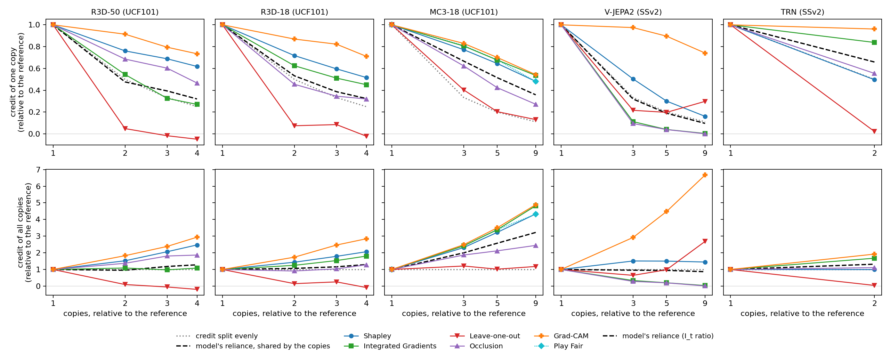
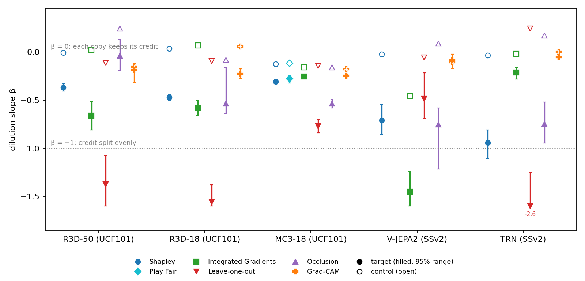

# E1 report: what attribution methods do when a frame is duplicated

This report brings together the E1 results for all models. Each model also has its own summary in `results/e1/`, with the full tables. Which models can be used, and why, is explained in `results/design_choice_report.md`.

## In short

We duplicated an important frame in a video clip and checked how attribution methods change its credit. We did this on five video models: R3D-50, R3D-18 and MC3-18 on UCF101, and V-JEPA2 and TRN on Something-Something v2.

**Main result.** On every model, duplicating a frame changes the credit that methods give it by much more than it changes how much the model relies on that frame. The methods fail in two ways:
- **Credit per copy too low.** Each copy looks less important than the frame did before. Leave-one-out does this on every model: each copy gets almost no credit. Integrated Gradients, occlusion and Shapley do it on some models.
- **Credit in total too high.** All copies together get more credit than the model's reliance supports. Grad-CAM does this on every model. Shapley does it on four of the five models.

**No method gets both right on any model.** So a frame's credit depends on how often it appears in the clip, not only on how much the model uses it. Real videos often contain repeated or near-identical frames (static shots, slow motion, densely sampled clips). This is the "attribution dilution" problem.

**Play Fair** gives the same values as Shapley with deleted frames (Shapley-drop), within random noise. We checked this on two models. So the Shapley-drop results apply to Play Fair.

## 1. The question

When a frame the model relies on appears m times in a clip, does an attribution method still give it the right amount of credit?

"The right amount" is judged against **the model itself**, not against an ideal. We remove every copy of the frame and see how much the predicted class's probability drops. This is the frame's *importance* I. We compare it before and after duplication. That comparison is the **I_t ratio**:
- **I_t ratio ≈ 1:** the model relies on the frame as much as before. Then the frame's credit shouldn't change just because it's repeated.
- **I_t ratio > 1:** the model relies on it more. Then the copies' total credit should grow by the same amount.

## 2. How the test works

### 2.1 Clips

Each video gives a set of frames, which we call *contents*. We build three kinds of clips:
- **Reference clip:** every content appears m_ref times.
- **Target clip:** one important content, the *target* t, appears m times.
- **Control clip:** the same change to the clip, but the extra copies go to other contents. The target keeps its reference number of copies.

The control shows what changes when the clip is changed in a similar way, but the target isn't duplicated. If a method's credit for t changes in the target clip and not in the control, the change is caused by duplicating t.

### 2.2 Two duplication designs

How copies can be added depends on what inputs the model accepts.

| design | used for | reference | how copies are added | control | how methods remove frames |
|---|---|---|---|---|---|
| **reallocation** | R3D-50, R3D-18, TRN | each content twice (m_ref = 2), fixed number of slots | the target takes slots from other contents (the *losers*), which drop to one copy | the losers drop to one copy, and the freed slots go to the least important content | fill with a neighbouring frame (freeze), so the length never changes |
| **insertion** | MC3-18, V-JEPA2 | the original clip, each frame once (m_ref = 1) | m − 1 copies of the target are inserted next to it, so the clip gets longer | m − 1 other frames each get one extra copy, so the clip has the same length | delete the frame (drop), so the clip gets shorter |

**Why two designs.** R3D-50 and R3D-18 lose accuracy when a clip is longer or shorter than 16 frames, even with the same content. TRN only accepts exactly 8 frames. These models need a fixed length, so they use reallocation and freeze. MC3-18 and V-JEPA2 don't depend on clip length, so they can use insertion and deletion. Play Fair deletes frames, so it can only be judged fairly on these two.

### 2.3 Other choices

- **Targets** are chosen by the model's own importance I, never by an attribution method. One target from the top 2 contents, and a second from the middle ranks when available. Both need I > 0.01.
- **The per-pair gate.** A target clip and its control are used only if the model gives both the same prediction as for the reference.
- **Copies** are either exact, or slightly noisy (Gaussian noise, σ = 2/255).

### 2.4 Methods

| method | how it works | removal |
|---|---|---|
| Shapley | averages a frame's effect over many random orders of adding frames | freeze or drop, as the design allows |
| Play Fair | the authors' code; the same quantity as Shapley-drop, with a different sampler | drop |
| Leave-one-out | the drop in probability when that one frame is removed | freeze or drop |
| Occlusion | the drop in probability when that one frame is replaced by a blank frame | – |
| Integrated Gradients | gradients summed along a path from a blank clip to the real one | – |
| Grad-CAM | gradient-weighted activations of an inner layer | – |

### 2.5 Readouts

Every readout compares the target's credit with its credit in the reference clip, for the same method.
- **Per-copy ratio:** the credit of one copy.
- **Total ratio:** the credit of all copies added up.
- **Dilution slope β:** how fast the credit per copy falls as m grows. β = 0 means each copy keeps its full credit, and β = −1 means the credit is split evenly between the copies. We compare β for the target with β for the control.
- **Ranking:** *inversions* (a frame ranked clearly below the target now ranks above it, while the model still ranks the target higher) and *top-1 loss* (the target was the method's top frame, but isn't any more).

## 3. Models and data

| model | data | design | m tested (reference) | videos / targets attributed | pairs kept by the gate | model's reliance on t at the highest m (I_t ratio) |
|---|---|---|---|---|---|---|
| R3D-50 | UCF101 | reallocation | 4, 6, 8 (2) | 120 / 175 | 91% / 82% / 79% | 1.28 |
| R3D-18 | UCF101 | reallocation | 4, 6, 8 (2) | 120 / 197 | 96% / 96% / 94% | 1.30 |
| MC3-18 | UCF101 | insertion | 3, 5, 9 (1) | 265 / 417 | 99% / 98% / 96% | **3.22** |
| V-JEPA2 | SSv2 | insertion | 3, 5, 9 (1) | 34 / 57 | 93% / 91% / 90% | 0.87 |
| TRN (official) | SSv2 | reallocation | 4 only (2) | 245 / 375 | 54% | 1.32 |

Not tested:
- **VideoMAE:** duplicating frames changes its output whatever the content. Its frame pairs (tubelets) of two identical frames lower its accuracy by up to 21 points. So no duplication design leaves the model unchanged. See `results/e1/VIDEOMAE_E1_summary.md`.
- **Play Fair's own TRN:** its checkpoints were deleted from the authors' Dropbox.

**Play Fair runs:** R3D-50 (20 videos, but its results there mix content with clip length) and MC3-18 (20 videos, 32 targets). Both used 256 samples per subset size and 1 seed.

**One model behaves differently.** On MC3-18, the model relies on the duplicated frame up to 3.2 times as much. MC3-18 averages over all frames at the end, so each copy adds weight. On the other four models, the model's reliance stays between 0.87 and 1.32.

## 4. Results

### 4.1 Credit per copy and in total



**Figure 5.** The target's credit relative to the reference, against the number of copies relative to the reference (log scale). Top: credit of one copy. Bottom: credit of all copies together. Exact copies, medians over targets. Black dashed line: the model's own reliance on the target (I_t ratio); in the top row, that reliance shared evenly between the copies. Grey dotted line: the credit split evenly between the copies. R3D-50's Play Fair run isn't shown, because on R3D-50 its values mix content with clip length.

The same numbers at the highest m. Exact copies, medians over targets:

| method | R3D-50 (×4) | R3D-18 (×4) | MC3-18 (×9) | V-JEPA2 (×9) | TRN (×2) |
|---|---|---|---|---|---|
| **model's reliance (I_t ratio)** | **1.28** | **1.30** | **3.22** | **0.87** | **1.32** |
| *per copy, if the credit is split evenly* | *0.25* | *0.25* | *0.11* | *0.11* | *0.50* |
| Shapley, per copy / total | 0.62 / 2.47 | 0.52 / 2.07 | 0.48 / 4.33 | 0.16 / 1.45 | 0.50 / 0.99 |
| Play Fair, per copy / total | – | – | 0.48 / 4.32 | – | – |
| Integrated Gradients | 0.27 / 1.08 | 0.45 / 1.80 | 0.54 / 4.82 | 0.00 / 0.04 | 0.84 / 1.68 |
| Leave-one-out | −0.05 / −0.19 | −0.02 / −0.08 | 0.13 / 1.18 | 0.30 / 2.69 | 0.02 / 0.04 |
| Occlusion | 0.47 / 1.87 | 0.32 / 1.28 | 0.27 / 2.45 | 0.00 / 0.01 | 0.55 / 1.11 |
| Grad-CAM | 0.73 / 2.94 | 0.71 / 2.84 | 0.54 / 4.89 | 0.74 / 6.67 | 0.96 / 1.92 |

"×4" means the target has 4 times as many copies as in the reference: m = 8 against m_ref = 2. Shapley uses freeze on R3D-50, R3D-18 and TRN, and drop on MC3-18 and V-JEPA2. Leave-one-out uses the same removal. On MC3-18, Play Fair's 20 videos give a model's reliance of 3.34.

### 4.2 What each method does, across models

**Leave-one-out gives each copy almost no credit.**
- Each copy keeps −0.05 to 0.13 of its credit on R3D-50, R3D-18, MC3-18 and TRN.
- The reason: removing one copy leaves the other copies in the clip, so the output barely changes. A frame the model needs is reported as unimportant.
- V-JEPA2 is the exception (0.2–0.3 per copy). There, deleting one frame changes how all later frames are paired into tokens, so removing a copy changes more than the copy.

**Shapley gives each copy less credit, and usually too much in total.**
- **R3D-50, R3D-18, MC3-18, V-JEPA2:** the copies' total is 1.3 to 1.9 times the model's reliance (for example 2.47 against 1.28 on R3D-50, and 1.45 against 0.87 on V-JEPA2). Each copy still looks less important than the frame did before.
- **TRN:** Shapley splits the credit exactly evenly (0.50 per copy, total 0.99). The model relies on the target 1.32 times as much, so each copy looks half as important as before.

**Play Fair gives the same values as Shapley-drop** (section 4.4).

**Integrated Gradients depends on the model.**
- **R3D-50 and V-JEPA2:** the credit is split evenly or vanishes (0.27 and 0.00 per copy). On V-JEPA2, the target's credit also falls in the control, so only part of this is caused by duplication.
- **R3D-18, MC3-18, TRN:** the total grows (1.68 to 4.82), above the model's reliance.

**Occlusion depends on the model.**
- **V-JEPA2:** each copy gets almost no credit, like leave-one-out elsewhere.
- **R3D-18, MC3-18, TRN:** less credit per copy (0.27 to 0.55).
- **R3D-50:** no effect specific to duplication. The target and the control change alike.

**Grad-CAM gives too much in total on every model** (1.9 to 6.7 times the reference). Each copy keeps most of its credit, so the total grows almost with the number of copies. On R3D-50, V-JEPA2 and TRN, its small fall per copy also appears in the control.

### 4.3 Is the change caused by duplication?



**Figure 6.** Dilution slope β for the target (filled, with 95% range) and its control (open), per model and method. Exact copies. β = 0: each copy keeps its credit. β = −1: the credit is split evenly. Values below −1 mean the credit went to almost 0. TRN has only one level (m = 4), so its β is a transformed per-copy ratio, not a fitted slope.

β, target (control in brackets). Exact copies:

| method | R3D-50 | R3D-18 | MC3-18 | V-JEPA2 | TRN |
|---|---|---|---|---|---|
| Shapley | −0.37 (−0.01) | −0.47 (+0.03) | −0.31 (−0.12) | −0.71 (−0.02) | −0.94 (−0.03) |
| Play Fair | – | – | −0.28 (−0.12) | – | – |
| Integrated Gradients | −0.66 (+0.02) | −0.58 (+0.07) | −0.25 (−0.16) | −1.45 (−0.46) | −0.21 (−0.02) |
| Leave-one-out | −1.38 (−0.11) | −1.55 (−0.09) | −0.77 (−0.14) | −0.48 (−0.05) | −2.60 (+0.25) |
| Occlusion | −0.04 (+0.24) | −0.54 (−0.08) | −0.53 (−0.16) | −0.75 (+0.09) | −0.75 (+0.17) |
| Grad-CAM | −0.19 (−0.15) | −0.23 (+0.06) | −0.25 (−0.18) | −0.08 (−0.11) | −0.05 (−0.00) |

What this shows:
- **Shapley and leave-one-out: caused by duplication on all five models.** The target's β is clearly negative, and the control's is near 0. (On MC3-18, the control is −0.12 to −0.18 for every method, because the control clip is longer and the model relies on the target a little less. That matches the model's own change of −0.14.)
- **Integrated Gradients and occlusion: caused by duplication on most models**, but not occlusion on R3D-50. On V-JEPA2, Integrated Gradients also falls in the control.
- **Grad-CAM: little per-copy change**, and on three models the control changes as much. So its main problem is the growing total, not the per-copy credit.
- **Noisy copies give the same results.** β changes by at most 0.06 on the UCF101 models and TRN, apart from leave-one-out on R3D-50 (0.13), and by at most 0.27 on V-JEPA2. So the effect isn't caused by pixel-identical frames.

### 4.4 Play Fair gives the same values as Shapley-drop

Play Fair and Shapley-drop use the same quantity (the model's probability with deleted frames, and a uniform class prior for an empty clip). They differ only in how they pick random subsets of frames. As a measure of pure noise, we compared Shapley-drop with itself, using two random seeds.

| | R3D-50 (27 targets) | MC3-18 (32 targets) |
|---|---|---|
| per-frame correlation: Play Fair vs Shapley-drop | 0.79 | 0.84 |
| per-frame correlation: Shapley-drop seed 1 vs seed 0 (noise only) | 0.65 | 0.78 |
| conditions where Play Fair is closer to seed 0 than seed 1 is | 91% | 88% |
| per-target differences (per-copy ratio, total ratio, β) whose 95% range includes 0 | all | all |

Play Fair is even closer to Shapley-drop than Shapley-drop is to itself, because it used more model evaluations per clip. MC3-18 is the stronger check, because deleting frames is valid on MC3-18 but not on R3D-50. **So the Shapley-drop results stand for Play Fair**, including on V-JEPA2, where Play Fair itself wasn't run.

### 4.5 Does duplication change which frame looks most important?

These numbers rest on fewer cases, so we treat them as extra evidence. Exact copies, highest m:

| model | Shapley: inversions, target vs control | Shapley: top-1 loss vs noise alone | Leave-one-out: inversions, target vs control |
|---|---|---|---|
| R3D-50 | 16% vs 13% | 0.71 vs 0.47 | 33% vs 17% |
| R3D-18 | 23% vs 9% | 0.75 vs 0.38 | 32% vs 17% |
| MC3-18 | 1% vs 6% | 0.24 vs 0.62 | 12% vs 0% |
| V-JEPA2 | 19% vs 18% | too few cases | 21% vs 14% |
| TRN | 36% vs 8% | 0.61 vs 0 (exact Shapley) | 39% vs 17% |

- **Leave-one-out changes the ranking on every model.** A duplicated frame drops below frames the model relies on less.
- **Shapley changes the ranking on R3D-18 and TRN**, and a little on R3D-50. On TRN, the duplicated target loses Shapley's top rank in 61% of cases.
- **Not on MC3-18**, because there the model relies on the target 3 times as much, and Shapley follows. **Not on V-JEPA2**, where target and control are alike.

## 5. Conclusions

1. **Duplicating a frame changes its credit much more than it changes the model.** On R3D-50, R3D-18, V-JEPA2 and TRN, the model relies on the duplicated frame 0.87 to 1.32 times as much as before. Yet the methods' credit per copy falls (to 0.16–0.62 for Shapley, and to about 0 for leave-one-out), or their total grows to 1.9–6.7 times the reference (Grad-CAM). In the control clips, the target's credit stays the same for Shapley and leave-one-out on every model. So duplication causes the change.

2. **Every method is wrong in at least one direction, on every model.**
   - Too little credit per copy: leave-one-out (all models), Integrated Gradients and occlusion (some models), Shapley on TRN.
   - Too much credit in total: Grad-CAM (all models), Shapley and Play Fair on R3D-50, R3D-18, MC3-18 and V-JEPA2, Integrated Gradients on R3D-18, MC3-18 and TRN.

3. **How a method fails depends on the model.** Shapley splits the credit exactly evenly on TRN, but only partly on R3D-50. Integrated Gradients splits it evenly on R3D-50, but inflates the total on MC3-18. So a method's behaviour under duplication can't be judged from one model.

4. **Play Fair has the same problem as Shapley-drop.** On MC3-18, where deleting frames is valid, it gives the copies 4.3 times the reference credit, while the model relies on the target 3.3 times as much.

5. **The effect doesn't need identical frames.** Copies with a little noise give the same results.

**For the paper.** In a video with repeated or near-identical frames, a frame's credit depends on how many similar frames surround it. Leave-one-out and occlusion can make repeated evidence invisible. Shapley-type methods, including Play Fair, make each copy look less important, and on some models the repeated frame loses its rank. E1 shows this with frames we duplicated ourselves. E2 and E3 test whether the same happens with the similar frames that real videos already contain.

## 6. Limitations

- **Selection.** Only videos the model classifies correctly, with at least one important frame, are used: 44–69% of screened videos on UCF101, and 23–47% on SSv2. The gate removes more pairs at higher m, and many pairs on TRN (54% kept).
- **Small samples on some models.** V-JEPA2 has 34 videos (57 targets), and Play Fair 20 videos per model. Their 95% ranges are wider.
- **TRN allows only one level** (m = 4). Its reference and control clips also change its prediction more often than on the other models.
- **The reallocation reference isn't the original clip.** It shows each content twice. It gives the same prediction as the original for 88% (TRN) to 96% (R3D-18) of videos.
- **On MC3-18, duplication changes the model.** Its results must be read against the rising I_t ratio, not against "no change".
- **The same random seed for every video.** Shapley's random orderings are the same for every clip of the same length. This doesn't bias the ratios (a target clip and its reference have different lengths), but the noise is shared across videos, so the 95% ranges may be somewhat too narrow. On MC3-18, Shapley-drop's two seeds agree at only 0.78 per frame.
- **One dataset per model**, and only appearance-heavy UCF101 or motion-heavy SSv2.

## 7. Files

| file | what it contains |
|---|---|
| `results/design_choice_report.md` | which models can be used, and why (all the length and duplication checks) |
| `results/e1/R3D_E1_summary.md` | R3D-50: full results, including the clip-length problem for the methods that delete frames |
| `results/e1/R3D18_E1_summary.md` | R3D-18 |
| `results/e1/MC3_18_E1_summary.md` | MC3-18, including Play Fair vs Shapley-drop |
| `results/e1/VJEPA2_E1_summary.md` | V-JEPA2 |
| `results/e1/TRN_E1_summary.md` | TRN (official) |
| `results/e1/VIDEOMAE_E1_summary.md` | why VideoMAE is excluded |
| `results/figures/fig5_e1_credit.png`, `fig6_e1_beta.png` | Figures 5 and 6 |
| `results/e1/<model>_summary.csv`, `<model>_beta.csv` | the numbers behind the tables (not in git) |

Figures:
```
python motivation/e1_report_figures.py      # needs numpy + matplotlib; not tc_env (MKL crash)
```
The per-model summaries list the commands for each run.
