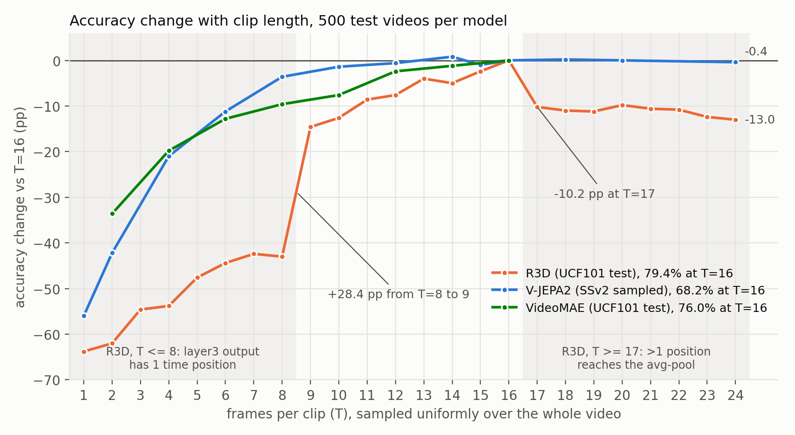
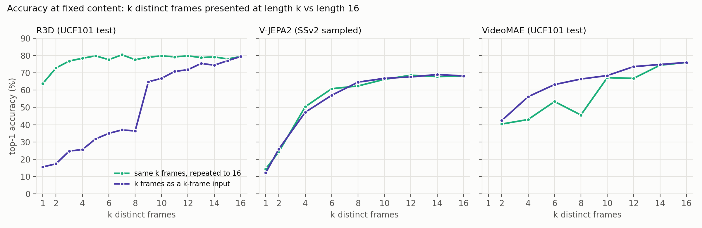
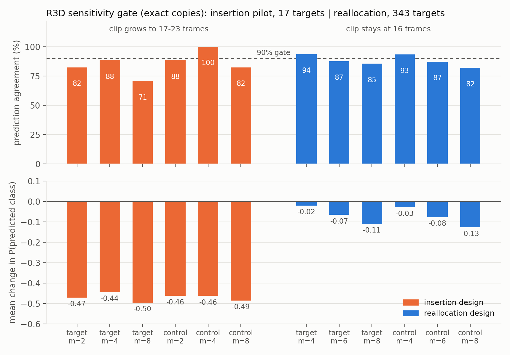
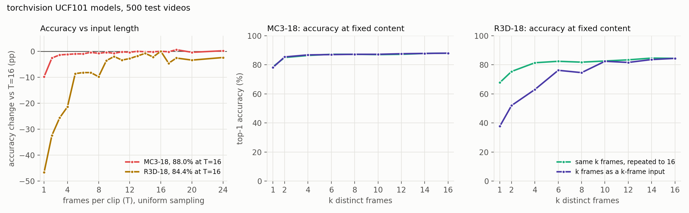

# Applicability of video models to E1: experiments, design choices and verdicts

E1 tests what frame-attribution methods do when a frame appears in a clip m times. This report records **which video models E1 can be applied to, and why**: the experiments run on each model, what they showed, and the duplication design each model uses (or why it's excluded).

Seven models were assessed: R3D-50, R3D-18, MC3-18 and VideoMAE on UCF101, and V-JEPA2, TRN (official) and Play Fair's TRN on Something-Something v2. Five are used in E1 (R3D-50, R3D-18, MC3-18, V-JEPA2, TRN official). VideoMAE is excluded on the evidence, and Play Fair's TRN is unavailable.

## 1. What E1 requires of a model

E1 interprets a change in a duplicated frame's attribution as a property of the **attribution method**. That interpretation needs four conditions:

1. **The model is evaluated as intended.** The checkpoint reproduces its expected accuracy with the preprocessing, frame sampling and class order used.
2. **Duplication doesn't change the input in ways other than duplication.** Every input the model sees during E1 (reference, duplicated clips, and the inputs produced when attribution methods remove frames) must lie within the range of inputs the model handles normally. In particular, if the model's output depends on **input length** or on other properties of the input format, the design must avoid that dependence, or it confounds the result.
3. **The model keeps its prediction under duplication** (the *gate*), so attributions are compared between clips classified the same way.
4. **The model's dependence on the duplicated content is measured, and is a response to that content.** If duplication changes how much the model relies on the content, the change has to be known, so that attributions can be judged against it. If the model reacts to duplication in a way that's **independent of the content** (any duplicated content is treated alike), E1 can't separate attribution errors from correct attributions.

## 2. Duplication designs

| design | reference | target condition | control | input length | frame removal |
|---|---|---|---|---|---|
| **insertion** | the original 16 frames, each once (m_ref = 1) | m − 1 copies of the target t **added** next to it | same length; the extra frames are copies of other contents (*spread control*) | 16 + m − 1 | deletion (`drop`) |
| **reallocation** | K = 8 contents (every other frame), each in **2** slots (m_ref = 2) | t takes m slots, freed by m − 2 other contents (*losers*) dropping to 1 copy | the same losers; the freed slots go to the least important content (*recipient*) | fixed (16, or 8 for TRN) | freeze (`late`: mean of filling from the previous and the next frame) |
| **replacement** | the original 16 frames, each once (m_ref = 1) | t fills a block of m consecutive slots, **replacing** m − 1 neighbouring frames | the same slots filled with the recipient | fixed (16) | deletion |

Insertion is the cleanest design, because nothing else in the clip changes. But it lengthens the input, so it requires a model whose output doesn't depend on length. Reallocation keeps the length fixed, but its reference presents every content twice, so it requires a model that tolerates repeated frames. Replacement keeps both the length and an original reference, at the cost of removing neighbouring frames. The design for each model is set in `MODEL_SPECS` in `motivation/e1_common.py`.

## 3. Experiments used to assess applicability

| test | what it measures | how | condition |
|---|---|---|---|
| **T0. Checkpoint check** | accuracy with our preprocessing, sampling and class order | `eval_accuracy.py`, or a full test-set run | 1 |
| **T1. Input-format limits** | which input lengths the model accepts at all | forward passes at other lengths; inspection of the architecture | 2 |
| **T2. Accuracy against input length** | whether the model's output changes **abruptly** with input length | `eval_frame_count.py`: T frames sampled uniformly over the whole video, 500 test videos. Each added frame is new content, so a smooth rise reflects information; a step change at one length reflects the architecture | 2 |
| **T3. Accuracy at fixed content** | whether **input length** affects the output **when the content is held fixed** | `eval_length_fixed_content.py`: the same k distinct frames presented as a k-frame input and with each frame repeated in consecutive slots to form a 16-frame input, 500 test videos | 2 (and whether repeated frames are tolerated) |
| **T4. Reference representativeness** | whether the E1 reference is classified like the original clip | E1 condition build: agreement between the original clip and the doubled reference (reallocation only) | 2 |
| **T5. Gate** | whether duplication preserves the prediction | E1 condition build (`e1_build_conditions.py`, `e1_metrics.py gate`): agreement with the reference for target and control at each m; share of target–control pairs where **both** clips keep the reference prediction (the per-pair gate used for attribution) | 3 |
| **T6. Model dependence on duplicated content** | how the model's reliance on t changes under duplication | the **I_t ratio**: model-based importance of t in the condition ÷ in the reference, where importance I(c) is the decrease in P(predicted class) when every copy of c is removed; compared with the control, and with the recipient where relevant | 4 |

T2 and T3 also decide whether the **deletion-based attribution methods** (Shapley-drop, leave-one-out-drop and Play Fair) are valid for a model. These evaluate the model on subsets of 1–24 frames, so a length effect at fixed content would enter their value function.

## 4. Verdicts

| model | data | T0 checkpoint | T1–T3 input length | T4 reference | T5 gate (pairs passing) | T6 dependence on t (I_t ratio) | **verdict and design** | deletion-based methods / Play Fair |
|---|---|---|---|---|---|---|---|---|
| **R3D-50** | UCF101 | 79.4% (500 test videos) | steps at 8/9 (+28.4 pp) and 16/17 (−10.2 pp); +41–52 pp for the same frames at length 16 | 94.1% agreement | 79–91% | 0.98–1.04 | **applicable: reallocation** | confounded by length |
| **R3D-18** | UCF101 | 82.95% (reported 83.43%) | steps at 4/5, 8/9, 16/17; up to +30 pp at fixed content | 95.7% | 92–95% | 1.02–1.33 | **applicable: reallocation** | confounded by length |
| **MC3-18** | UCF101 | 86.83% (reported 87.05%) | flat from 3 to 24 frames; ≤ 0.4 pp at fixed content | – (original reference) | 96–99% | **2.01–3.19** (rises with m; content-specific) | **applicable: insertion** | **valid** (small confidence effect) |
| **V-JEPA2** | SSv2 | 68.2% (500 videos) | smooth; flat 10–24 frames; ≤ 3.8 pp at fixed content | – (original reference) | 89–93% | 0.85–0.95 | **applicable: insertion** | **valid** |
| **TRN (official)** | SSv2 | ≈ 30–34% | accepts exactly 8 frames | 87.8% | 54% (one level, m = 4) | 1.00 (all targets) | **applicable with limitations: reallocation** | not possible (fixed 8 inputs) |
| **VideoMAE** | UCF101 | 76.0% (500 videos) | max 16 frames; pairs of identical frames cost up to 20.8 pp | **37.2%** (reallocation) | 80–96% (replacement) | **negative** for any duplicated content (replacement) | **excluded** | – |
| **TRN (Play Fair)** | SSv2 | – | – | – | – | – | **unavailable** (checkpoints deleted) | – |

The R3D-50, V-JEPA2, VideoMAE, MC3-18 and R3D-18 accuracies in T0 are on the 500-video subsets used in T2–T3 (the full test-set accuracies of MC3-18 and R3D-18 are given in brackets). SSv2 accuracies are on `ssv2_sampled`.



**Figure 1.** T2 for R3D-50, V-JEPA2 and VideoMAE: top-1 accuracy at T frames minus each model's own 16-frame accuracy, 500 test videos per model, frames sampled uniformly over the whole video (nothing is duplicated). The shaded bands are R3D-50's two out-of-regime ranges (T ≤ 8 and T ≥ 17). The models are on different datasets, so only the change is comparable, not the accuracy levels.



**Figure 3.** T3 for R3D-50, V-JEPA2 and VideoMAE. For each k, the same k distinct frames are presented as a k-frame input and repeated to form a 16-frame input. A gap between the curves is an effect of input format with the content held fixed: R3D-50 is much more accurate at length 16; V-JEPA2 shows no gap; VideoMAE is **less** accurate when frames are repeated, in proportion to the number of frame pairs made of identical frames.

---

## 5. R3D-50 (3D ResNet-50, UCF101) → applicable, reallocation

**Model.** 3D ResNet-50 from Hara et al.'s 3D-ResNets-PyTorch, Kinetics-pretrained and fine-tuned on UCF101 (`models/r3d/ucf101.json`, `models/r3d/ckpt/save_200.pth`). 16 frames at 112 px. The stem has a 7 × 7 × 7 convolution followed by a max-pool that halves time; stages 2–4 halve time again.

**First attempt: insertion (failed).** R3D-50 is fully convolutional and ends in an adaptive average over time, so it accepts any length, and the generated E1 code started it on insertion. In the 20-video insertion pilot, predictions for the target **and** the control changed in up to 29% of cases, and P(predicted class) fell by about 0.46 in **every** condition (Figure 2, left). Because the control duplicates other frames, this pointed at the input length, not the duplicated frame.

**Why: temporal resolution changes at specific lengths.** Each of R3D-50's four temporal stages (max-pool and stages 2–4) maps T positions to ⌊(T − 1)/2⌋ + 1:

| T | after max-pool | layer2 | layer3 | layer4 (into avg-pool) | regime |
|---|---|---|---|---|---|
| ≤ 8 | ≤ 4 | ≤ 2 | **1** | 1 | layer4's temporal convolution sees a single position |
| 9–16 | 5–8 | 3–4 | **2** | **1** | **the regime the checkpoint was trained in** |
| 17 | 9 | 5 | 3 | **2** | more than one position reaches the average, dominated by zero-padded edges |
| 24 | 12 | 6 | 3 | 2 | same |

**T2 (Table 1, Figure 1).** Two step changes, one at each regime boundary: accuracy drops **10.2 pp from 16 to 17 frames** (74 videos become wrong, 23 become right) and jumps **28.4 pp from 8 to 9 frames**. Between the boundaries, accuracy rises gradually.

**Table 1.** R3D-50, `ucf101_test`, 500 videos, uniform sampling. Changed predictions are counted relative to T = 16.

| T | 1 | 2 | 3 | 4 | 5 | 6 | 7 | **8** | **9** | 10 | 11 | 12 |
|---|---|---|---|---|---|---|---|---|---|---|---|---|
| accuracy (%) | 15.6 | 17.4 | 24.8 | 25.6 | 31.8 | 35.0 | 37.0 | **36.4** | **64.8** | 66.8 | 70.8 | 71.8 |
| change vs 16 (pp) | −63.8 | −62.0 | −54.6 | −53.8 | −47.6 | −44.4 | −42.4 | **−43.0** | **−14.6** | −12.6 | −8.6 | −7.6 |
| correct → wrong | 326 | 314 | 282 | 276 | 249 | 233 | 222 | 226 | 90 | 77 | 61 | 55 |
| wrong → correct | 7 | 4 | 9 | 7 | 11 | 11 | 10 | 11 | 17 | 14 | 18 | 17 |

| T | 13 | 14 | 15 | **16** | **17** | 18 | 19 | 20 | 21 | 22 | 23 | 24 |
|---|---|---|---|---|---|---|---|---|---|---|---|---|
| accuracy (%) | 75.4 | 74.4 | 77.0 | **79.4** | **69.2** | 68.4 | 68.2 | 69.6 | 68.8 | 68.6 | 67.0 | 66.4 |
| change vs 16 (pp) | −4.0 | −5.0 | −2.4 | 0 | **−10.2** | −11.0 | −11.2 | −9.8 | −10.6 | −10.8 | −12.4 | −13.0 |
| correct → wrong | 33 | 33 | 22 | – | 74 | 76 | 77 | 73 | 79 | 80 | 88 | 91 |
| wrong → correct | 13 | 8 | 10 | – | 23 | 21 | 21 | 24 | 26 | 26 | 26 | 26 |

**T3 (Table 3b, Figure 3).** The same k ≤ 8 distinct frames are classified correctly in 16–36% of videos as a k-frame input and in 64–80% when repeated to 16 frames. R3D-50's accuracy loss on short inputs is therefore an effect of length, not of lost information. Its classifications rely mainly on single-frame appearance: one frame repeated 16 times gives 63.8%.

**Decision: reallocation, with freeze removal (m = 2 (reference), 4, 6, 8).** Every input, including every input evaluated during freeze-based attribution, has exactly 16 frames, inside the 9–16-frame regime. The deletion-based methods remain confounded by length (see `results/e1/R3D_E1_summary.md`).

**T4–T6 (Figure 2, Table 2).** Gate on 500 test videos: 220 kept (102 misclassified, 178 without a content above I = 0.01), 343 targets.

**Table 2.** R3D-50 gate, exact copies (near-duplicates within about 1 pp).

| design | condition | m | n | agreement (%) | mean ΔP(pred) | median I_t ratio |
|---|---|---|---|---|---|---|
| insertion (pilot) | target | 2 / 4 / 8 | 17 | 82.4 / 88.2 / 70.6 | −0.47 / −0.44 / −0.50 | −17.4 / −17.1 / −17.3 |
| insertion (pilot) | control (spread) | 2 / 4 / 8 | 17 | 88.2 / 100 / 82.4 | −0.46 / −0.46 / −0.49 | −16.1 / −0.05 / −0.10 |
| reallocation | original vs doubled reference | – | 220 | 94.1 | −0.001 | – |
| reallocation | target | 4 / 6 / 8 | 343 | 93.6 / 87.5 / 85.4 | −0.020 / −0.067 / −0.110 | 0.98 / 1.01 / 1.04 |
| reallocation | control (recipient) | 4 / 6 / 8 | 343 | 93.3 / 87.2 / 81.9 | −0.028 / −0.077 / −0.127 | 0.80 / 0.57 / 0.42 |

- **Under insertion, the I_t ratio was about −17:** removing the copies shortened the input back below 17 frames and **raised** P(pred). It measured length, not the target.
- **Under reallocation, the model's dependence on t stays at 0.98–1.04 of its reference value.**
- **Agreement falls about 3 pp per step in m, as much in the control as in the target.** The cause is the losers (2, 4, 6 contents reduced to one copy), not duplication of t.
- **The doubled reference changes the prediction in 5.9% of videos,** with almost no change in confidence (−0.001).

A single 90% threshold per m would keep only m = 4, so the **per-pair gate** is used: a target–control pair is analysed only if both clips keep the reference prediction. That retains 91.0 / 82.2 / 79.0% of pairs at m = 4 / 6 / 8, with a mild selection bias toward videos whose prediction survives losing other content.



**Figure 2.** R3D-50 gate with exact copies. Left: insertion pilot (20 videos, 17 targets). Right: reallocation (500 videos, 343 targets). Top: % of conditions whose predicted class matches the reference. Bottom: mean change in P(predicted class).

**Verdict: applicable, with reallocation and freeze-based methods.** E1 results: `results/e1/R3D_E1_summary.md` (120 videos attributed).

---

## 6. R3D-18 (torchvision, UCF101) → applicable, reallocation

**Model.** torchvision `r3d_18`, Kinetics-400 pretrained, fine-tuned on UCF101 split 1 (`dronefreak/r3d-18-ucf101` on the Hugging Face Hub; `models/torchvision_ucf101.py`). 16 frames at 112 px. Stages 2–4 halve time; unlike R3D-50, there's no max-pool in the stem.

**T0.** The publisher's inference code (16 frames at `linspace(0, n − 1, 16)`, resize to 128 × 171, centre-crop 112, Kinetics mean/std) was reproduced. The checkpoint numbers classes in Python's `sorted()` order of the class folder names, **not** in the `classInd.txt` order used by the publisher's predictor. The two orders differ at HammerThrow/Hammering and JumpRope/JumpingJack. On the 3,782 readable split-1 test videos, the sorted order gives **82.95%** (reported 83.43%), against 80.41% for the `classInd` order, which scores 0.0% on the four affected classes.

**T2–T3 (Figure 4, Tables 5 and 5b).** Step changes at 4 → 5 (+12.8 pp), 8 → 9 (+6.2 pp) and 16 → 17 (−4.6 pp), where the number of time positions after its three stride-2 stages changes. That's R3D-50's mechanism, with boundaries shifted. At fixed content, the 16-frame presentation is up to 30 pp more accurate (67.8% vs 37.8% at k = 1). Repeated frames are tolerated, because it reads frames individually.

**T4–T6.** Gate on 500 test videos: 345 kept (95 misclassified, 60 without a content above I = 0.01), 547 targets (345 high, 202 mid).

| condition | m = 4 | m = 6 | m = 8 |
|---|---|---|---|
| original vs doubled reference | 95.7% agreement, ΔP +0.004 | | |
| target agreement / ΔP(pred) | 96.7% / +0.002 | 96.2% / +0.008 | 94.9% / −0.002 |
| control agreement / ΔP(pred) | 96.7% / −0.006 | 96.9% / −0.002 | 94.5% / −0.009 |
| target I_t ratio / control I_t ratio | 1.02 / 0.95 | 1.17 / 0.91 | 1.33 / 0.86 |
| pairs passing the per-pair gate | 95.2% | 94.9% | 91.8% |

**Verdict: applicable, with reallocation and freeze-based methods (m = 2, 4, 6, 8).** The doubled reference is classified like the original clip, duplication preserves the prediction for about 95% of targets, and the model's dependence on t is close to its reference value. It serves as a replication of R3D-50 in a different implementation and depth. E1 attribution: pending.

---

## 7. MC3-18 (torchvision, UCF101) → applicable, insertion

**Model.** torchvision `mc3_18`, Kinetics-400 pretrained, fine-tuned on UCF101 split 1 (`dronefreak/mc3-18-ucf101`). Mixed convolutions: 3D convolutions in the first stage, convolutions over space only in stages 2–4. Time is therefore never downsampled, and the classifier averages over all time positions.

**T0.** Same preprocessing and class-order finding as R3D-18: **86.83%** on 3,782 test videos with the sorted order (reported 87.05%), against 84.21% with the `classInd` order.

**T2–T3 (Figure 4, Tables 5 and 5b).**
- **No step change at any length,** and inputs of 17–24 frames are classified as accurately as 16 frames (87.6–88.6%).
- **At fixed content, input length doesn't affect accuracy** (≤ 0.4 pp; same prediction in 87–99% of videos).
- **A small length effect remains in confidence:** with few distinct frames, the shorter input gives a **higher** probability for the true class (0.74 vs 0.57 at k = 1; 0.67 vs 0.64 at k = 8; equal at k = 14).
- **The model relies heavily on single-frame appearance** (78.2% from one frame), so many videos have no single frame above the target threshold.

**Table 5.** MC3-18 and R3D-18, accuracy (%) against input length, uniform sampling, 500 test videos.

| T | 1 | 2 | 4 | 5 | 8 | 9 | 12 | **16** | 17 | 18 | 20 | 24 |
|---|---|---|---|---|---|---|---|---|---|---|---|---|
| MC3-18 | 78.2 | 85.4 | 86.8 | 87.0 | 87.2 | 87.6 | 87.6 | **88.0** | 87.8 | 88.6 | 87.6 | 88.2 |
| R3D-18 | 37.8 | 52.0 | 63.0 | 75.8 | 74.6 | 80.8 | 81.6 | **84.4** | 79.8 | 81.8 | 81.0 | 82.0 |

**Table 5b.** Accuracy (%) at fixed content.

| k | 1 | 2 | 4 | 6 | 8 | 10 | 12 | 14 |
|---|---|---|---|---|---|---|---|---|
| MC3-18, k-frame input | 78.2 | 85.4 | 86.8 | 87.0 | 87.2 | 87.2 | 87.6 | 87.8 |
| MC3-18, repeated to 16 | 78.6 | 85.0 | 86.4 | 87.2 | 87.2 | 87.0 | 87.2 | 87.8 |
| R3D-18, k-frame input | 37.8 | 52.0 | 63.0 | 76.2 | 74.6 | 82.4 | 81.6 | 83.6 |
| R3D-18, repeated to 16 | 67.8 | 75.4 | 81.4 | 82.4 | 81.8 | 82.6 | 83.4 | 84.6 |

**T5–T6.** Gate on 500 test videos: 265 kept (71 misclassified, 164 without a content above I = 0.01), 417 targets (265 high, 152 mid).

| condition | m = 3 | m = 5 | m = 9 |
|---|---|---|---|
| target agreement / ΔP(pred) | 99.5% / **+0.024** | 99.5% / **+0.037** | 98.8% / **+0.051** |
| control agreement / ΔP(pred) | 98.8% / −0.009 | 98.8% / −0.016 | 96.9% / −0.029 |
| target I_t ratio / control I_t ratio | **2.01** / 0.90 | **2.55** / 0.83 | **3.19** / 0.70 |
| pairs passing the per-pair gate | 98.6% | 98.3% | 95.9% |

**The model's dependence on duplicated content increases with m.** Removing all copies of t lowers P(predicted class) 2.0–3.2 times as much as removing the single original frame, and duplicating t raises the predicted-class probability. This follows from the architecture: the m copies make up m of the 18–24 time positions entering the final average, so t's content gets more weight in the output.

The response is **specific to the content**. When the recipient is duplicated instead, the dependence on t falls (0.90 → 0.70), as t becomes a smaller share of the input. This differs from VideoMAE (section 9), whose response to duplication didn't depend on which content was duplicated.

**Consequence.** For MC3-18 the reference point for attributions isn't "unchanged". It's the measured I_t ratio. A method consistent with the model would assign t's copies a **total** attribution of about 2.0, 2.6 and 3.2 times the reference at m = 3, 5, 9, or **per copy** about 0.67, 0.51 and 0.35 (I_t ratio ÷ m). Exact division of a fixed total would give 0.33, 0.20 and 0.11 per copy.

**Verdict: applicable, with insertion and deletion-based methods, including Play Fair (m = 1, 3, 5, 9).** MC3-18 is the UCF101 model on which Play Fair's behaviour under duplication can be evaluated without R3D's length confound. Attributions must be judged against the measured, increased dependence on t. E1 attribution: pending (see the open items for a performance issue).



**Figure 4.** T2 and T3 for MC3-18 and R3D-18 on 500 UCF101 test videos. Left: accuracy change relative to 16 frames against input length. Middle and right: accuracy at fixed content.

---

## 8. V-JEPA2 (ViT-L, fpc16, SSv2) → applicable, insertion

**Model.** `facebook/vjepa2-vitl-fpc16-256-ssv2`. 3D rotary position encoding computed from each token's index (no fixed-size table), frame pairs embedded jointly (tubelet = 2), no strided pooling over time, and an attentive-pooling classifier that accepts any number of tokens.

**T2 (Table 3, Figure 1).** Accuracy rises smoothly and saturates: the gain per added frame falls from 13.8 pp (1 → 2) to about 1 pp (8 → 10). It's flat from 10 to 24 frames (within 0.4 pp of 16 frames at 18, 20, 24), and videos change prediction in both directions about equally.

**Table 3.** V-JEPA2, `ssv2_sampled`, 500 videos, uniform sampling.

| T | 1 | 2 | 4 | 6 | 8 | 10 | 12 | 14 | 15 | **16** | 18 | 20 | 24 |
|---|---|---|---|---|---|---|---|---|---|---|---|---|---|
| E1 condition | | | | | | | | | | reference (m = 1) | m = 3 | m = 5 | m = 9 |
| accuracy (%) | 12.2 | 26.0 | 47.2 | 57.0 | 64.6 | 66.8 | 67.6 | 69.0 | 67.2 | **68.2** | 68.4 | 68.2 | 67.8 |
| change vs 16 (pp) | −56.0 | −42.2 | −21.0 | −11.2 | −3.6 | −1.4 | −0.6 | +0.8 | −1.0 | 0 | +0.2 | 0 | −0.4 |

**T3 (Table 3b, Figure 3).**

**Table 3b.** Accuracy at fixed content, 500 videos per model (R3D-50 for comparison).

| k distinct frames | 1 | 2 | 4 | 6 | 8 | 10 | 12 | 14 | 16 |
|---|---|---|---|---|---|---|---|---|---|
| V-JEPA2, k-frame input (%) | 12.2 | 26.0 | 47.2 | 57.0 | 64.6 | 66.8 | 67.6 | 69.0 | 68.2 |
| V-JEPA2, repeated to 16 (%) | 14.4 | 24.4 | 50.4 | 60.8 | 62.4 | 66.2 | 68.6 | 67.8 | 68.2 |
| R3D-50, k-frame input (%) | 15.6 | 17.4 | 25.6 | 35.0 | 36.4 | 66.8 | 71.8 | 74.4 | 79.4 |
| R3D-50, repeated to 16 (%) | 63.8 | 72.8 | 78.4 | 77.6 | 77.6 | 79.8 | 79.8 | 79.2 | 79.4 |

The two presentations differ by at most 3.8 pp, with no consistent sign, so **input length at fixed content has no systematic effect**. Accuracy depends on the number of distinct frames (14.4% from one repeated frame), as expected for SSv2's temporal classes. Pairs of identical frames are tolerated (62.4% vs 64.6% at k = 8, where every pair consists of identical frames).

**Design: insertion, with odd m (m = 1, 3, 5, 9).** With odd m, the m − 1 inserted copies fill whole frame pairs, so every original pair stays intact. Even m would shift every later pair by one frame.

**T5–T6.** Gate on 72 screened videos: 34 kept (26 misclassified, 12 without a content above I = 0.01), 57 targets. Target agreement is 94.7 / 96.5 / 94.7% at m = 3 / 5 / 9 (control 96.5 / 91.2 / 89.5%). The I_t ratio is 0.95 / 0.94 / 0.85, and 89.5–93.0% of pairs pass the per-pair gate.

**Notes.** At m = 3, two copies share a `[t, t]` token group and the original sits with a neighbouring frame. The number of token groups containing t is 1, 2, 3, 5 for m = 1, 3, 5, 9. Under deletion, removing one frame changes the pairing of all later frames; T3 doesn't isolate that effect.

**Verdict: applicable, with insertion and deletion-based methods, including Play Fair.** It's the SSv2 model on which Play Fair's quantity can be evaluated under duplication. E1 results: `results/e1/VJEPA2_E1_summary.md` (34 videos; official Play Fair not yet run, Shapley-drop estimates the same quantity).

---

## 9. VideoMAE (ViT-B, UCF101) → excluded

**Model.** `nateraw/videomae-base-finetuned-ucf101`: 16 frames at 224 px, tubelet = 2, a **fixed** sinusoidal position table of 16 ÷ 2 × (224/16)² = **1,568 tokens**.

**T0.** In this environment (`transformers` 5.8.0.dev0), the checkpoint's q/v attention biases weren't loaded and were left at zero. `models/videomae_ucf101.py` restores them. 76.0% on the 500 test videos.

**T1 (Table 4).** Inputs longer than 16 frames produce more tokens than the table has rows, so insertion is impossible.

**Table 4.** Forward pass of the loaded checkpoint.

| T | tokens | result |
|---|---|---|
| 16 | 1568 | runs |
| 18 | 1764 | `RuntimeError: size of tensor a (1764) must match ... (1568)` |
| 24 | 2352 | `RuntimeError: size of tensor a (2352) must match ... (1568)` |

**T2–T3 (Figures 1 and 3, Table 4b).** Shorter inputs run by slicing the table to the first T/2 time positions. Accuracy rises smoothly from 42.4% (2 frames) to 76.0% (16), and at fixed content the k-frame input is never less accurate than the repeated input, so there's no length penalty. But the repeated input **loses accuracy in proportion to the number of frame pairs made of two identical frames**: −13.2 pp (k = 4) and −20.8 pp (k = 8) when every pair consists of identical frames, and −0.4 to −6.8 pp when half or fewer do.

**Table 4b.** VideoMAE, accuracy at fixed content (500 videos).

| k distinct frames | 2 | 4 | 6 | 8 | 10 | 12 | 14 | 16 |
|---|---|---|---|---|---|---|---|---|
| k-frame input (%) | 42.4 | 56.2 | 63.2 | 66.4 | 68.4 | 73.6 | 74.8 | 76.0 |
| repeated to 16 (%) | 40.4 | 43.0 | 53.4 | 45.6 | 67.2 | 66.8 | 74.4 | 76.0 |
| pairs of identical frames (repeated input) | 8 / 8 | 8 / 8 | 6 / 8 | 8 / 8 | 4 / 8 | 4 / 8 | 2 / 8 | 0 / 8 |

**T4, reallocation (failed).** The reallocation reference (8 contents, 2 consecutive slots each) makes every frame pair consist of identical frames. On 50 videos (`results/e1/videomae_diag`; 43 kept), its prediction agrees with the original clip's in only **37.2%** of videos (R3D-50 94.1%, R3D-18 95.7%, TRN 87.8%). The probability of the original prediction falls by 0.36, and accuracy falls from 79% to 37%.

**T5–T6, replacement (failed).** A replacement design was implemented for VideoMAE (`design="replace"`): the original 16 frames as the reference, and the target's m copies replacing m − 1 neighbouring frames in a pair-aligned block. On 50 videos (`results/e1/videomae_replace_diag`; 33 kept, 57 targets), the prediction is preserved (target agreement 96.4 / 96.2 / 85.7 / 86.7%, 80–96% of pairs passing at m = 2, 4, 6, 8). But the model-based importance of **any** duplicated content becomes **negative**:

| m | I(t), reference | I(t), target condition | I(recipient), reference | I(recipient), control |
|---|---|---|---|---|
| 2 | +0.052 | −0.011 | +0.001 | −0.020 |
| 4 | +0.063 | −0.028 | +0.001 | −0.033 |
| 6 | +0.065 | −0.058 | +0.001 | −0.049 |
| 8 | +0.066 | −0.062 | +0.001 | −0.083 |

Deleting the consecutive copies raises the predicted-class probability, whether the duplicated content is the important target or the unimportant recipient. When duplicated, t's importance is indistinguishable from the recipient's, although it's about 50–65 times larger in the reference. Reference importances show no dependence on slot position (correlation with slot index −0.025), so this isn't an artefact of deletion re-pairing frames.

**Verdict: excluded.** VideoMAE responds to pairs of identical frames, which any duplication into consecutive slots creates, independently of their content. Its dependence on duplicated content therefore isn't a response to that content (condition 4), and a lower attribution for the copies would be consistent with the model's behaviour. Duplicating whole frame pairs instead of single frames would avoid identical-frame pairs, but changes the unit of duplication and wasn't pursued. Details: `results/e1/VIDEOMAE_E1_summary.md`.

---

## 10. TRN (official) (BN-Inception + multi-scale relation heads, SSv2) → applicable with limitations, reallocation

**Model.** The original TRN-pytorch multi-scale checkpoint (`TRN_something_RGB_BNInception_TRNmultiscale_segment8_best.pth.tar`). Each of exactly **8** frames is embedded as a 256-dimensional feature, and the features are concatenated in order into relation heads whose input sizes are fixed in the checkpoint:

| scale (frames) | 8 | 7 | 6 | 5 | 4 | 3 | 2 |
|---|---|---|---|---|---|---|---|
| fc input size | 2048 | 1792 | 1536 | 1280 | 1024 | 768 | 512 |
| frame subsets | 1 | 8 | 28 | 56 | 70 | 56 | 28 |
| subsets sampled per forward | 1 | 3 | 3 | 3 | 3 | 3 | 3 |

The relation module samples frame subsets at random on every forward pass; the E1 adapter fixes that randomness so repeated evaluations give identical outputs.

**T0.** The checkpoint loads with `torch.load(weights_only=False)` (PyTorch ≥ 2.6 refuses it by default). Accuracy is about 30% on `ssv2_sampled` (30.0% on 60 videos; 33.6% on the full SSv2 folder).

**T1.** Inputs must have exactly 8 frames, so only reallocation over 8 slots is possible: K = 4 contents, m = 2 (reference) and **4** (the only other level, since m ≤ K). Deletion-based methods, including Play Fair, can't be applied as published. Play Fair evaluates a k-frame subset with a model trained for k frames, and those models are unavailable; using the 2–7-frame relation heads alone would define a different value function.

**T4–T6.** Condition build on all 1,044 `ssv2_sampled` videos: 245 kept (778 misclassified, 21 without a content above I = 0.01), 375 targets (245 high, 130 mid).

| condition (m = 4) | agreement | mean ΔP(pred) | I_t ratio |
|---|---|---|---|
| original 8 frames vs doubled reference | **87.8%** | −0.047 | – |
| target | **72.3%** | −0.142 | 1.00 (all targets); 1.32 (pairs passing) |
| control | **60.0%** | −0.241 | 0.58 (all); 0.98 (pairs passing) |

Pairs passing the per-pair gate: **202 of 375 (53.9%)**, from 166 videos. Mid-tier targets pass less often (34%) than high-tier targets (64%).

**Verdict: applicable with limitations, reallocation with freeze-based methods.**
- **Applicable:** the reference is classified like the original clip in 88% of videos, and in the analysed pairs the model's dependence on t is preserved or increased (I_t ratio 1.32) by duplication, as a content-specific response (the control's dependence on t stays at 0.98).
- **Limitations:**
  - **one duplication level** (m = 4), so results are single ratios, not slopes;
  - **a large perturbation:** at m = 4, two of the four contents are reduced to one slot, so only 54% of pairs pass the gate and the selection is strong;
  - **low accuracy**, so most videos are excluded;
  - **no deletion-based methods.**

E1 results: `results/e1/TRN_E1_summary.md`.

## 11. TRN (Play Fair) → unavailable

Play Fair's own TRN (`trn.pth` backbone and `trn_8_frames.pth` relation head, plus the per-length models `trn_1_frames.pth` … `trn_16_frames.pth` its method relies on) is hosted on the Play Fair authors' Dropbox. Every link now returns "File Deleted", including those in Play Fair's own `download.sh`, and the local copies are the HTML pages. The model can't be evaluated unless the files are obtained from the authors or an earlier copy.

---

## 12. Open items

1. **MC3-18 and R3D-18 attribution** (conditions and gates are complete).
   - **Performance issue:** on MC3-18, batches of 16 inputs with ≥ 18 frames take 1.3–9 s in fp32, against 0.18 s at 17 frames, which makes Shapley-drop at m = 9 about 20× slower than expected. Smaller batches don't show the effect. The fix (for example, limiting the number of frames per batch) needs to be chosen before the full run.
2. **V-JEPA2:** run official Play Fair to compare it directly with Shapley-drop; enlarge the sample if compute allows.
3. **VideoMAE:** excluded. Optional: duplicate whole frame pairs instead of single frames.
4. **TRN (Play Fair):** unavailable.

## 13. Reproducing

```
# T0: accuracy (torchvision models: sorted class order is the wrapper's default)
python eval_accuracy.py --model mc3_18 --dataset ucf101_test
python eval_accuracy.py --model r3d_18 --dataset ucf101_test

# T2 (Figure 1, Tables 1, 3, 5)
python eval_frame_count.py --models r3d --frames 12 13 14 15 16 17 18 19 20 21 22 23 24 --limit 500 --datasets r3d=ucf101_test --out results/frame_count_r3d
python eval_frame_count.py --models r3d --frames 1 2 3 4 5 6 7 8 9 10 11 --limit 500 --datasets r3d=ucf101_test --out results/frame_count_r3d_short
python eval_frame_count.py --models vjepa2 --frames 16 18 20 24 --limit 500 --datasets vjepa2=ssv2_sampled
python eval_frame_count.py --models vjepa2 --frames 1 2 4 6 8 10 12 14 15 16 --limit 500 --datasets vjepa2=ssv2_sampled --out results/frame_count_vjepa2_short
python eval_frame_count.py --models videomae --frames 2 4 6 8 10 12 14 16 --limit 500 --datasets videomae=ucf101_test --out results/frame_count_videomae
python eval_frame_count.py --models mc3_18 r3d_18 --frames 1 2 3 4 5 6 7 8 9 10 11 12 13 14 15 16 17 18 20 24 --limit 500 --datasets mc3_18=ucf101_test r3d_18=ucf101_test --out results/frame_count_tv

# T3 (Figure 3, Tables 3b, 4b, 5b)
python eval_length_fixed_content.py --models r3d --datasets r3d=ucf101_test --ks 1 2 3 4 5 6 7 8 9 10 11 12 13 14 15 16 --limit 500 --out results/length_fixed_content_r3d
python eval_length_fixed_content.py --models vjepa2 --datasets vjepa2=ssv2_sampled --ks 1 2 4 6 8 10 12 14 16 --limit 500 --out results/length_fixed_content_vjepa2
python eval_length_fixed_content.py --models videomae --datasets videomae=ucf101_test --ks 2 4 6 8 10 12 14 16 --limit 500 --out results/length_fixed_content_videomae
python eval_length_fixed_content.py --models mc3_18 r3d_18 --datasets mc3_18=ucf101_test r3d_18=ucf101_test --ks 1 2 4 6 8 10 12 14 16 --limit 500 --out results/length_fixed_content_tv

# T4-T6: condition builds and gates (current MODEL_SPECS)
python motivation/e1_build_conditions.py --model r3d --limit 500 --ms 2 4 6 8
python motivation/e1_build_conditions.py --model r3d_18 --limit 500
python motivation/e1_build_conditions.py --model mc3_18 --limit 500
python motivation/e1_build_conditions.py --model vjepa2 --limit 72 --fp16          # Colab
python motivation/e1_build_conditions.py --model trn_official
python motivation/e1_metrics.py gate --model <model>

# R3D-50 insertion pilot (Figure 2, left; with design="insert" for r3d in MODEL_SPECS)
python motivation/e1_build_conditions.py --model r3d --limit 20

# VideoMAE design checks
# reallocation (with design="realloc", removal="late" for videomae):
python motivation/e1_build_conditions.py --model videomae --limit 50 --ms 2 --dup-types exact --include-wrong --out results/e1/videomae_diag
# replacement (current MODEL_SPECS):
python motivation/e1_build_conditions.py --model videomae --limit 50 --fp16 --out results/e1/videomae_replace_diag

# figures (needs only matplotlib; tc_env's numpy/MKL crashes in matplotlib, use another env)
python results/design_choice_figures.py
```

| file | contents |
|---|---|
| `results/frame_count_r3d*_*.csv`, `results/frame_count_summary.csv`, `results/frame_count_vjepa2_short_*.csv`, `results/frame_count_videomae_*.csv`, `results/frame_count_tv_*.csv` | T2: accuracy against input length (summary and per-video predictions) |
| `results/length_fixed_content_r3d_*.csv`, `results/e1/length_fixed_content_vjepa2_*.csv`, `results/length_fixed_content_videomae_*.csv`, `results/length_fixed_content_tv_*.csv` | T3: accuracy at fixed content |
| `results/tv_ucf101_accuracy_preds.csv`, `results/tv_ucf101_accuracy.log` | T0 for MC3-18 and R3D-18, full test set, both class orders |
| `results/e1/<model>_conditions.jsonl`, `<model>_skipped.jsonl`, `<model>_gate.csv` | T4–T6 for r3d, r3d_18, mc3_18, vjepa2, trn_official |
| `results/e1/r3d_insert_pilot/` | R3D-50 insertion pilot |
| `results/e1/videomae_diag/`, `results/e1/videomae_replace_diag/` | VideoMAE design checks |
| `results/figures/fig1_accuracy_vs_length.png`, `fig2_r3d_gate.png`, `fig3_fixed_content.png`, `fig4_torchvision_length.png` | figures |
| `results/e1/R3D_E1_summary.md`, `TRN_E1_summary.md`, `VJEPA2_E1_summary.md`, `VIDEOMAE_E1_summary.md` | E1 results per model |
